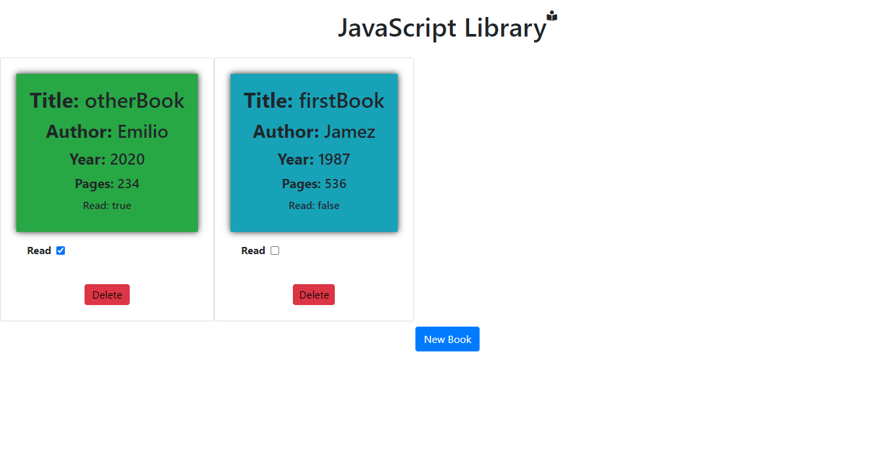

# JavaScript Library

This is a library web page where the user can upload books information and the books will be saved in the browser until its reloaded. The user can give the book information as title, author, year, and pages. 

> This repo includes the code for the JavaScript Library. User could download the code and use it to generate a new web page with new properties as the user could want.

## Built With

- HTML
- CSS
- JavaScript

## Live Demo

- Netifly Website.

You can click on this [link](https://goofy-darwin-269eea.netlify.app/)

## Getting Started

To get a local copy up and running follow these simple example steps.

-[x] 1.- Click on the install or download button under the repository name and copy the URL by clicking on the icon.

-[x] 2.- Open your terminal. To open the terminal, press Ctrl+Alt+T(Ubuntu) or if you are using Mac Command + Space and type in 'Terminal'.

-[x] 3.- Navigate to the location in your computer where you want the repo to be cloned. Remeber that you have to type 'cd' first.

-[x] 4.- Type git clone and paste the url you copied on step one.

### Deployment

To deploy this repo, we used Netifly web app.

> You can access to the deployed app following this [link](https://goofy-darwin-269eea.netlify.app/)

## Authors

👤 **Emilio Contreras**

- Github: [@emiliocm9](https://github.com/emiliocm9)
- Twitter: [@emiliocm31](https://twitter.com/emiliocm31)
- Email: [email](emilio.contreras97@gmail.com)

👤 **James Chigozie Odufu**

- Github: [@githubhandle](https://github.com/jamezjaz)
- Twitter: [@twitterhandle](https://twitter.com/jamezjaz90)
- Linkedin: [@linkedin](https://www.linkedin.com/in/jamesgozieodufu/) 

## 🤝 Contributing

Contributions, issues and feature requests are welcome!

Feel free to check the [issues page](issues/).

## Show your support

Give a ⭐️ if you like this project!

## Acknowledgments

- Project inspired by Microverse Program.
